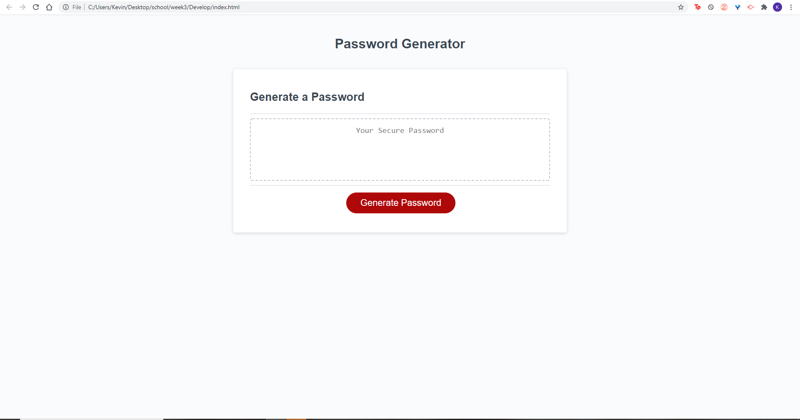
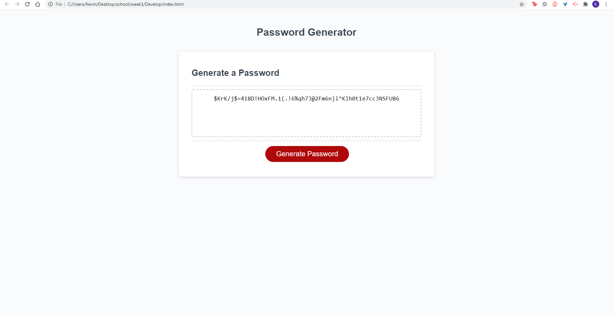
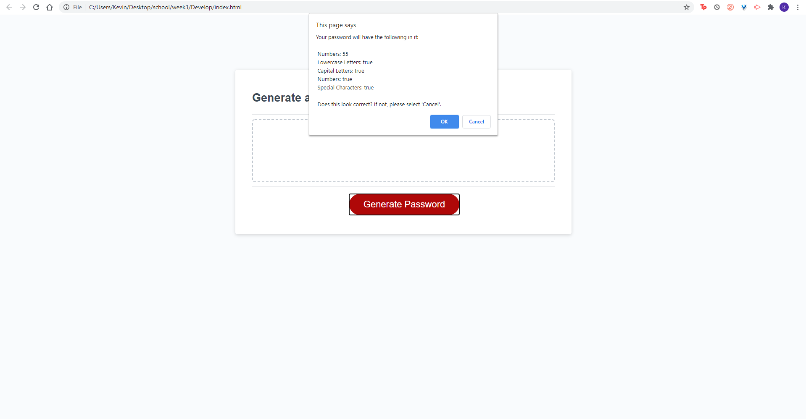

# Password-Gen
- Built for random generation of passwords
- Used HTML, CSS and JavaScript
- https://kevintulakyan.github.io/Password-Gen/Develop/index.html

## Usage
1. User is prompted to pick the length of the password
2. Then the user is asked what kinda of combo they want for their password
3. User is then given a list of what they picked and confrim password gen

